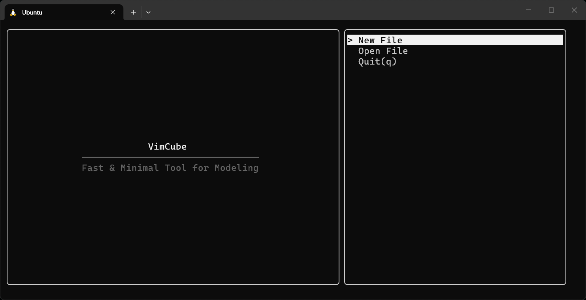
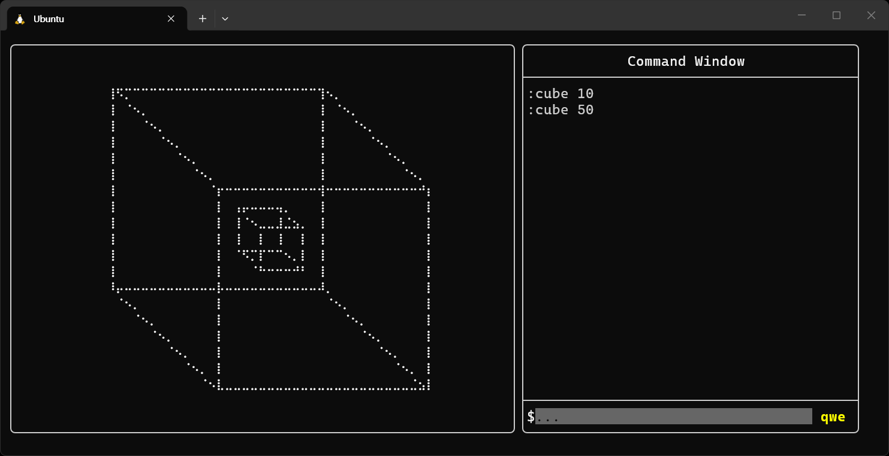

# VimCube - Work in Progress

**VimCube** is a lightweight, high-performance TUI 3D concept modeler with FTXUI for developers and power users who favor Vim-style modal editing. Designed specifically for terminal environments, it combines intuitive single-key navigation with a non-destructive procedural pipeline, allowing users to build, manipulate, and export 3D geometries via UNIX-inspired command sequences without relying on a GUI or mouse. By leveraging CPU-based matrix transformations and rendering wireframes through high-resolution Braille Unicode characters, VimCube delivers a fast and fluid 3D modeling experience directly within your shell, complete with JSON pipeline saving and standard OBJ file export options.

# Features

## Partially Available 

- TUI Interface

- Vim-style Key Binding

- Basic Commands(press colon(:) to use)

- Basic Geometry Types

- Drawing Geometries on Canvas using Braille Dots

## Planned

- Variable Commands and Key Bindings(transform, move, boolean modifier...)

- MVP Matrix Calculation to Project 3D Objects onto 2D Canvas

- More Geometry Types

- File I/O (.json)